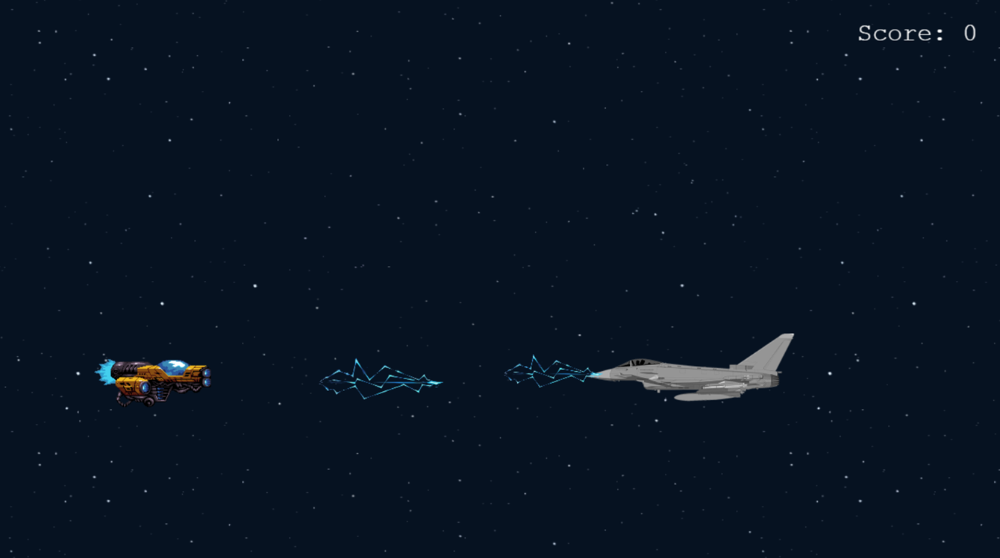

# Space Runner 🚀

Welcome to **Space Runner** – a 2D arcade space shooter built with **Phaser**. Control your spaceship, dodge enemy attacks, destroy enemy ships, and compete for the highest score on the online leaderboard powered by Firebase.



## Features

- Smooth spaceship movement using keyboard controls
- Shoot lasers with a cooldown system
- Randomly spawning enemy spaceships
- Enemy AI capable of shooting back
- Collision detection between lasers, enemies, and the player
- Explosion effects with sound effects
- Score tracking during gameplay
- Game Over screen with final score
- Online leaderboard using Firebase Firestore
- Player name registration before starting the game
- Responsive canvas that adapts to different screen sizes

## Demo

Check out the live version:

https://space-runner-game.vercel.app/

## Technologies Used

- **Phaser** – game engine
- **JavaScript (ES6 Modules)** – game logic
- **Firebase Firestore** – online leaderboard
- **Vite** – development server and bundler
- **CSS** – styling

## Installation

To run this project locally, follow these steps:

1. Clone this repository:

```bash
git clone https://github.com/MilotaiEduard/Space-Runner.git
```

2. Navigate to the project folder:

```bash
cd space-runner
```

3. Install dependencies:

```bash
npm install
```

4. Create a `.env` file in the root directory and add your Firebase configuration:

```env
VITE_FIREBASE_API_KEY=your_api_key
VITE_FIREBASE_AUTH_DOMAIN=your_auth_domain
VITE_FIREBASE_PROJECT_ID=your_project_id
VITE_FIREBASE_STORAGE_BUCKET=your_storage_bucket
VITE_FIREBASE_MESSAGING_SENDER_ID=your_sender_id
VITE_FIREBASE_APP_ID=your_app_id
```

5. Start the development server:

```bash
npm run dev
```

The application will open at:

```
http://localhost:5173
```

## Project Structure

```
src/
│
├── scenes/
│   ├── Menu.js
│   ├── Controls.js
│   ├── NameEntry.js
│   ├── Start.js
│   ├── GameOver.js
│   └── Leaderboard.js
│
├── firebase.js
├── scoreService.js
├── main.js
│
assets/
│
├── background
├── spaceship
├── enemy spaceship
├── laser
├── explosion
└── sounds
```

## Gameplay

- Enter your player name before starting the game.
- Move your spaceship using the **Arrow Keys**.
- Shoot lasers using the **Space Bar**.
- Destroy enemy spaceships to earn points.
- Avoid enemy ships and enemy lasers.
- Try to achieve the highest score and climb the online leaderboard.

## Future Improvements

- Multiple enemy types
- Boss battles
- Power-ups (shield, rapid fire, double lasers)
- Health system
- Difficulty scaling
- Background music and additional sound effects
- Animated explosions
- Mobile support

## Author

Developed by **Eduard Milotai**